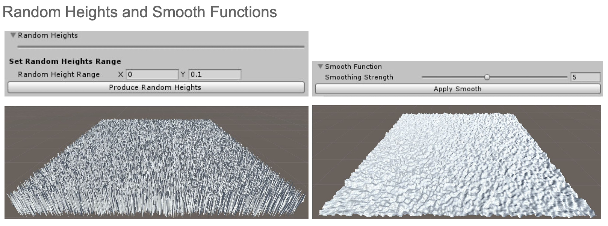
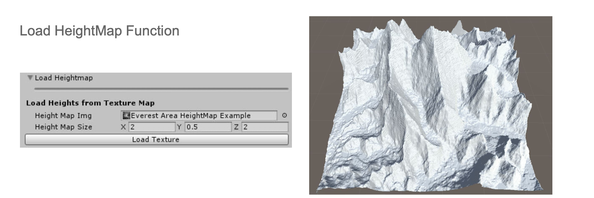
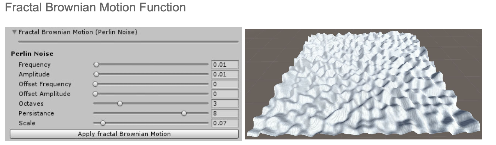
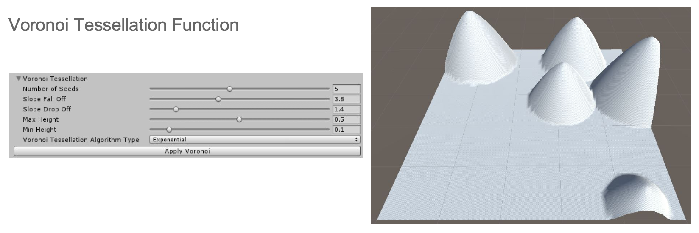
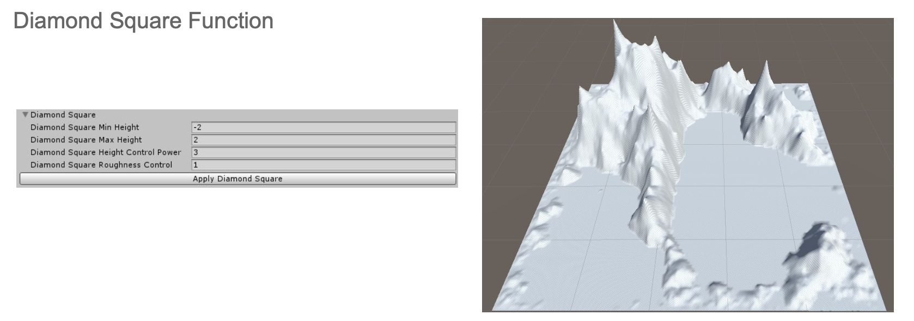
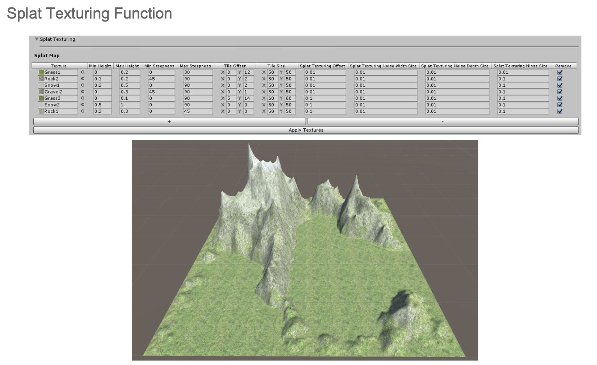

# ProceduralTerrainGeneration
Unity project for procedurally generating terrain/landscape from within the project window

Below are some procedurally generated results from this project. The different results are obtained using different functions based on popular algorithms. They are shown alongside the UI sections for tuning and applying the different functions. 
The terrain game object needs to hold the TerrainS script in its script component for the user to be able to access and use the UI. It appears under the script component that belongs to the terrain game object. For each implemented function, a different foldout menu is created from which the user can adjust the values of the parameters that are used for each function. Adjusting the values for parameters will help the user tune how the resulting terrain is generated. A button exists in each foldout to apply the function with the adjusted parameters. There also exists a checkbox at the top part of the set up UI which gives the user the choice to reset the terrain or not before applying any function. 

The edtior script is dependent on the "Editor GUI Table" asset pack obtained from: https://assetstore.unity.com/packages/tools/gui/editor-gui-table-108795

Here's a link to a video (no sound) of the scripts being used:
https://www.dropbox.com/s/st03843jin3j46c/producralLandscapeGeneration%20EarlyDemonstrationVid.mp4?dl=0

I hope to come back to this project in the future and add more features. 
